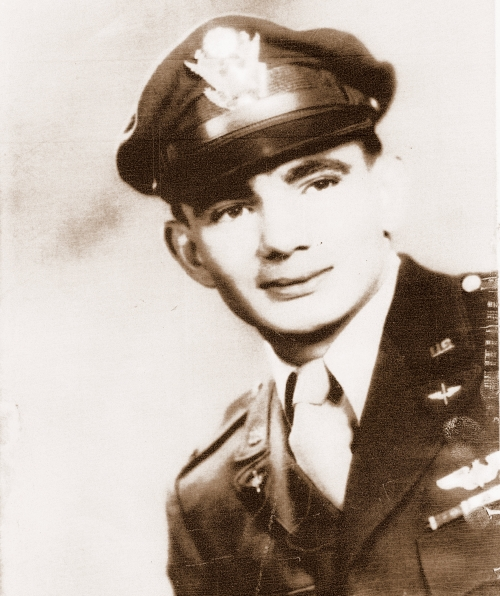

# Murray Lirette report — asset manifest

## Recommended structure

```text
murray_site/
  index.html
  assets/
    images/
      murray-lirette-wartime-portrait.jpg
      murray-lirette-pyote-crew.jpg
      murray-lirette-reunion-2025.jpg
      100th-bg-veterans-flag-2025.jpg
      katie-b17-42-39983.png
      michoud-et1-rollout-1977.jpg                 # download from NASA source below
      martin-marietta-1984-lirette-award.png      # crop from page 2 of newsletter below
```

## Assets already included in this package

- `murray-lirette-wartime-portrait.jpg` — Murray Lirette wartime portrait. Source/credit: 100th Bomb Group Foundation, courtesy of Murray Lirette.
- `murray-lirette-pyote-crew.jpg` — original Stateside training crew at Pyote, Texas; Lirette kneeling bottom right. Source/credit: 100th Bomb Group Foundation, courtesy of Murray Lirette.
- `murray-lirette-reunion-2025.jpg` — Murray Lirette recognized at the 2025 100th Bomb Group reunion. Credit: U.S. Air Force / Karen Abeyasekere.
- `100th-bg-veterans-flag-2025.jpg` — surviving WWII veterans at the 2025 reunion with the 100th Bomb Group flag. Credit: U.S. Air Force / Karen Abeyasekere.
- `katie-b17-42-39983.png` — B-17G 42-39983 “Katie.” Preserve the source credit in the report: Imperial War Museums / American Air Museum archive.

## Assets to download for the final public site

### First Space Shuttle External Tank rollout, Michoud, 9 Sept. 1977
Recommended filename: `michoud-et1-rollout-1977.jpg`

Direct NASA image:
https://www.nasa.gov/wp-content/uploads/2023/08/et_contract_4_mpta_external_tank_rollout_maf_gpn-2000-000051_sep_9_1977.jpg

Context/source page:
https://www.nasa.gov/history/50-years-ago-nasa-selects-contractor-for-space-shuttle-external-tank/

Credit: NASA.

### Martin Marietta News — Murray Lirette New Technology award, 30 Mar. 1984
Recommended filename: `martin-marietta-1984-lirette-award.png`

Source PDF:
https://marsretirees.org/wp-content/uploads/historical-documents/Martin%20Marietta%20News%201984-06.pdf

Crop the “New technology awards go to 8” item on page 2. It names “Murray J. Lirette, Michoud production operations” and the “Safing System for Robots and Repetitive Motion Machines.” Preserve the publication/date in the caption.

## Linking recommendation

For a real website, self-host the image files and reference them with relative URLs like:

```html

```

Avoid base64-embedding images in the final site: it makes the HTML enormous, hurts caching, and is harder to maintain. Avoid hotlinking third-party images long term because URLs can change or servers can block external embedding. Download a permitted copy, preserve the credit/source URL in the caption or metadata, and serve it from your own site/CDN.

For 100th Bomb Group Foundation / IWM images, confirm reuse terms before publishing publicly. For NASA images, keep the NASA credit and source link.
